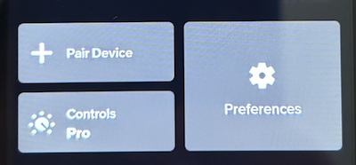
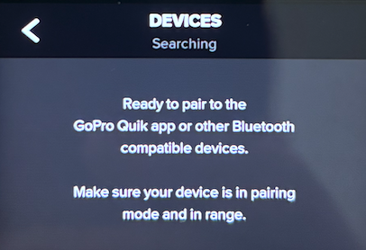
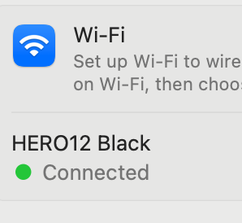
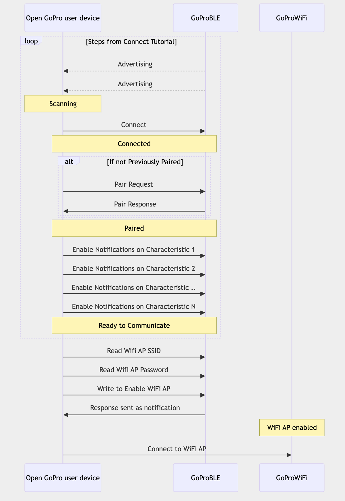

# Go-Pro-BLE

### What is this?

This is a Go implementation of the following OpenGoPro Python scripts:
- [connect_ble.py](https://github.com/gopro/OpenGoPro/blob/main/demos/python/tutorial/tutorial_modules/tutorial_1_connect_ble/ble_connect.py)
- [enable_wifi_ap.py](https://github.com/gopro/OpenGoPro/blob/main/demos/python/tutorial/tutorial_modules/tutorial_6_connect_wifi/enable_wifi_ap.py)
- [connect_as_sta.py](https://github.com/gopro/OpenGoPro/blob/main/demos/python/tutorial/tutorial_modules/tutorial_6_connect_wifi/connect_as_sta.py)

The Python implementation uses [Bleak](https://github.com/hbldh/bleak).

This implementation uses [TinyGo](https://tinygo.org/).

### What does it do?

1. Connects to your GoPro via BLE.
2. Using BLE, enables the WIFI AP on your GoPro (can only be done programmatically)
3. Retrieves the credentials for the AP.
4. Uses those credentials to authenticate and establish a connection to the AP

### Then what?

Once connected, you'll have access to your [GoPro's HTTP API](https://gopro.github.io/OpenGoPro/http).

### How?

There is an existing HTTP client here https://github.com/chrisjoyce911/goprowifi but, that pkg doesn't support establishing wireless connectivity.

So before this pkg came along, you had to use [OpenGoPro Python scripts](https://github.com/gopro/OpenGoPro/tree/main/demos/python/tutorial/tutorial_modules) for wireless connections first.

Also, it's pretty old and is for older GoPro's ( <= HERO5 ).

But now, you can use this pkg to solve for wireless connectivity.

For new GoPro's like the one I have (HERO12+), I plan on writing a higher level client/sdk using this pkg as it's base.

### Considerations

This was manually tested on OSX using a GoPro HERO12 Black.

### Instructions

1. On your computer, make sure Bluetooth is enabled.

2. On your GoPro, navigate to your settings and click "Pair Device"

3. On your computer, run the script

        go run examples/connect/main.go

4. Verify connectivity

### How it works

