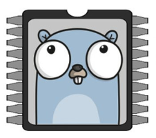

# Go-Pro-BLE

### What is this?

This is a Go implementation of the following OpenGoPro Python scripts:
- [connect_ble.py](https://github.com/gopro/OpenGoPro/blob/main/demos/python/tutorial/tutorial_modules/tutorial_1_connect_ble/ble_connect.py)
- [enable_wifi_api.py](https://github.com/gopro/OpenGoPro/blob/main/demos/python/tutorial/tutorial_modules/tutorial_6_connect_wifi/enable_wifi_ap.py)
- [connect_as_sta.py](https://github.com/gopro/OpenGoPro/blob/main/demos/python/tutorial/tutorial_modules/tutorial_6_connect_wifi/connect_as_sta.py)

The Python implementation uses [Bleak](https://github.com/hbldh/bleak).

This implementation uses [TinyGo](https://tinygo.org/).

### What does it do?

1. Connects to your GoPro via BLE.
2. Using BLE, enables the WIFI access point on your GoPro (can only be done programmatically)
3. Retrieves the credentials for the access point
4. Connects to the access point.

### Considerations

This was manually tested on a GoPro Hero 12 Black and OSX.

### Instructions

1. On your computer, make sure Bluetooth is enabled.

2. On your GoPro, navigate to your settings and click "Pair Device"

3. On your computer, run the script

        go run examples/enable-wap/main.go

4. Verify connectivity

### How it works

